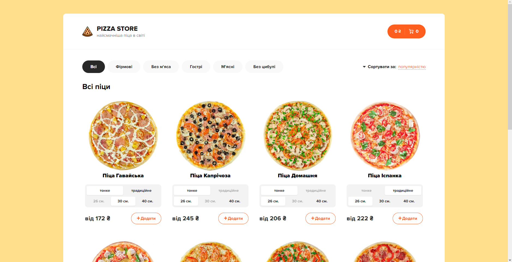
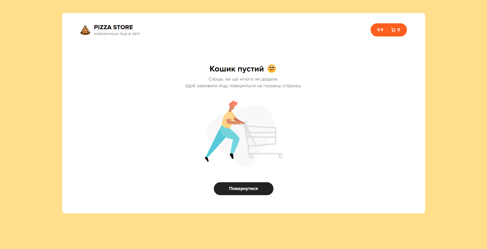

# Pizza Store

A simple front-end with json-server to practice react.
As simple as necessary for practice project.

# Stack

- react
- react-router
- redux
- axios
- parcel (as bundler)

# Scripts

- `yarn run server` stars json-server with default configuration
- `yarn run start` starts application in developer mode
- `yarn run build` builds application for production

# Screenshots

